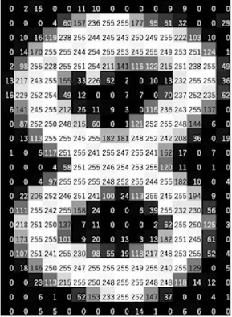

# Grayscale Images Overview

This document provides a detailed look at grayscale images, describing their properties, applications, and the basics of their dimensions and data storage.

## 1. Definition and Characteristics

### Single Channel
Unlike color images, which use three channels (red, green, and blue) to render colors, grayscale images use only one channel. This single channel measures light intensity on a scale from black (no light) to white (full intensity).

### Values
The intensity in a grayscale image is typically stored as an 8-bit integer, providing a range of 0 to 255 levels of gray, where 0 represents black and 255 represents white.

### Applications
Grayscale images are commonly used in various applications such as document scanning, medical imaging (like X-rays), and image processing tasks where color information is not necessary.

## 2. Width and Height

### Width
The width of a grayscale image is the number of pixel columns it contains. This represents the horizontal dimension of the image.

### Height
The height of a grayscale image is the number of pixel rows it contains. This represents the vertical dimension of the image.

### Pixel
In grayscale images, each pixel represents light intensity and holds a single value detailing this intensity.

## 3. Example 

The image appears to be a representation of a grayscale image as seen by a computer, specifically in the form of a matrix of pixel values. Each number in the matrix corresponds to a pixel's intensity in the image, with values typically ranging from 0 to 255 in an 8-bit grayscale image.

In a grayscale image, the value 0 represents black, the darkest possible shade, and 255 represents white, the lightest shade. Shades of gray are represented by values in between, with lower numbers being darker and higher numbers being lighter.

For example, in the top left corner of the matrix in the image, you have values "0 2 15 0 11 10 0 0 0 9 9" and so on, indicating that the top left corner starts with a black pixel (0), then a very dark pixel (2), followed by a slightly lighter shade of dark gray (15), and this pattern continues with various shades of gray represented by their respective numbers.

When a computer processes this image, it reads these values to understand the intensity of each pixel and uses this information to recreate the image visually on a screen or to perform operations like edge detection, contrast enhancement, or object recognition. In deep learning, these pixel values would be the input features for a model, which it would use to perform tasks such as image classification, object detection, or even generating new images.

## 4. More About Grayscale Images

### Storage Efficiency
Grayscale images require less storage space than full-color images, making them more efficient for uses where color information is not critical.

### Processing Speed
Algorithms processing grayscale images generally run faster than those processing equivalent color images, as there is less data to manipulate (one channel versus three).

### Visual Processing
Studies in vision science show that humans can perceive a high degree of detail in grayscale, which explains the effectiveness of black-and-white imagery in various artistic and practical applications.

## 5. Conversion from Color to Grayscale

To convert a color image to grayscale, the RGB values for each pixel are reduced to a single intensity value. A common method involves taking a weighted sum of the RGB values, with more weight typically given to the green channel, followed by the red and blue channels. This reflects the human eye's varying sensitivity to these colors.The reason for weighting the green channel more heavily than red and blue channels in the conversion of color images to grayscale is based on human visual perception. Our eyes are more sensitive to green light due to the way the human retina is structured, influencing how digital systems process color to grayscale conversions. Here’s a deeper look into the "why" and "how" of this process:

### Human Eye Sensitivity

Cones and Color Sensitivity: The human retina contains three types of cone cells, each sensitive to different wavelengths of light—specifically red, green, and blue. However, the cones that detect green light are the most numerous and, collectively, more sensitive to light in this part of the spectrum.
Perceptual Importance: Evolutionarily, the sensitivity to green light has likely developed due to its predominance in nature and its importance in tasks requiring high detail resolution, such as hunting or foraging in forested environments.

### Photopic Vision

Peak Sensitivity: Human vision under well-lit conditions, also known as photopic vision, peaks in the green wavelengths. This peak sensitivity means that the human eye perceives more luminance detail in the parts of the spectrum where green light resides.

### Luminance Calculation in Digital Imaging

Standard Formulas: When converting color images to grayscale, a common formula derived from the luminance (perceived brightness) calculation is used. This formula is:
    Luminance=0.2126×R+0.7152×G+0.0722×B
    Luminance=0.2126×R+0.7152×G+0.0722×B
where RR, GG, and BB represent the red, green, and blue components of a pixel, respectively.
Coefficients Explained:
Green (0.7152): This coefficient is the highest because the human eye is most sensitive to green light, and it dominates human luminance perception.
Red (0.2126) and Blue (0.0722): These coefficients are lower, reflecting the lesser sensitivity of human vision to these colors compared to green.

Application in Technology

Image Processing: In digital imaging, this weighted approach ensures that the conversion to grayscale reflects a more true-to-life representation of how humans would perceive the scene in black and white. This is important for applications where accurate luminance representation is necessary, such as image analysis, medical imaging, and quality visual media production.
Consistency Across Devices: Using these standardized coefficients helps maintain consistency in how images are viewed across different devices and software, adhering to international standards like those set by the International Telecommunication Union (ITU) for broadcasting and image processing.

## 6. Applications

Medical Imaging: In fields like medical diagnostics, grayscale imaging is predominant (e.g., X-rays, MRI scans), making deep learning models tailored to grayscale images highly applicable.
Facial Recognition: Grayscale images are often used in facial recognition technologies because they allow algorithms to concentrate on structural features without color information.
Surveillance: Many surveillance systems operate in low light conditions or use infrared imaging, resulting in grayscale images. Deep learning models can be optimized for these conditions to enhance performance in object and activity recognition tasks.

---

This README.md file serves to educate and provide resources on the nuances and uses of grayscale images, useful for both educational purposes and practical applications in projects.
