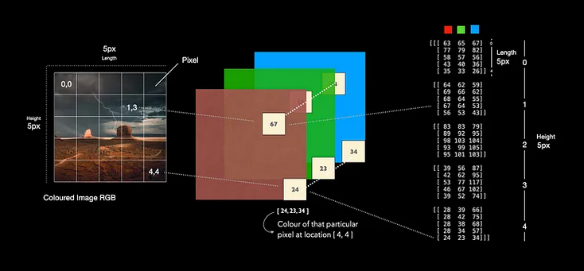

# Understanding RGB in Deep Learning

RGB (Red, Green, Blue) color model is essential in digital imaging and is widely utilized in deep learning, especially in tasks that involve image processing and computer vision. This document explores the use of RGB images in deep learning, detailing their advantages, challenges, and typical applications.

## Composition of RGB Images

- **Color Channels**: RGB images are composed of three color channels—red, green, and blue. These channels combine at various intensities to produce a wide range of colors, with each channel typically holding an 8-bit value from 0 to 255. This setup allows for approximately 16.7 million possible colors in the RGB color space.
- **Pixel Data**: Each pixel in an RGB image is represented by a triplet of values (R, G, B), where each component contributes to the overall color and intensity of the pixel.

## How It Looks to a Computer:

To a computer, an RGB image is seen as a three-dimensional array (or tensor in the context of deep learning) where two dimensions represent the spatial dimensions (width and height), and the third dimension represents the color channels. For instance, a 100x100 pixel RGB image would be represented as a 100x100x3 array:

[100, 100, 0]: This slice represents all the red channel values of the image.
[100, 100, 1]: This slice represents all the green channel values.
[100, 100, 2]: This slice contains all the blue channel values.

## Example

Let’s have an example. In the illustration above, imagine the picture on the left only has a size of 5x5 pixels. Thus, the image consist of 25 pixels in total. In reality, we would barley see a picture this small, but it is a good size for illustration purposes. As you can see the image has a grid. This grid can be used to access each pixel. On the right, we see how the python library OpenCV (cv2) stores this particular picture, namley in matrices with a shape of [5,5,3]. The last index (3) indicates the three different colours Red, Green, Blue. If we now access one particular pixel, for instance at location [4,4] we receive the pixel values [24,23,34]. The first value depicts the intensity for the colour red, the second one represents the intensity for the colour green and the last one for blue. In combination, those three colours yield a new colour which is depicted at this particular pixel location. Those values range from 0–255.

## Advantages of RGB in Deep Learning

1. **Color Information**: RGB provides crucial color information that aids in tasks such as object detection, scene recognition, and image classification.
2. **Data Richness**: The data-rich nature of RGB images allows for nuanced insights and detailed feature extraction, which are beneficial in complex applications like autonomous driving or medical image analysis.
3. **Detailed Feature Extraction**: CNNs can leverage the color differentiation in RGB images to enhance detection and classification accuracy.

## Challenges with RGB in Deep Learning

1. **Higher Computational Cost**: Processing RGB images involves higher computational resources, as there are three data points per pixel to analyze.
2. **Increased Model Complexity**: Additional color channels add complexity to neural network architectures, which may extend training times and increase memory demands.
3. **Overfitting Risk**: The richness of RGB data can heighten the risk of overfitting, especially with limited training data.

## Deep Learning Techniques with RGB

1. **Preprocessing**: RGB images often require normalization, data augmentation, and color adjustments as preprocessing steps to enhance model training effectiveness.
2. **Feature Learning in CNNs**: Convolutional layers in CNNs process patterns in different color channels, integrating them in deeper layers to form a comprehensive image understanding.
3. **Transfer Learning**: Models pre-trained on RGB datasets like ImageNet are frequently used as starting points for custom tasks, facilitating high accuracies even with smaller datasets.

## Applications of RGB in Deep Learning

- **Image and Video Recognition**: RGB is crucial for real-time object identification in video feeds, used in surveillance and automotive safety systems.
- **Medical Imaging**: Certain medical imaging techniques use RGB for highlighting biological markers in histopathology slides.
- **Augmented and Virtual Reality**: Accurate color processing in RGB is vital for AR and VR applications, creating immersive environments.

In conclusion, the RGB color model significantly enhances the functionality and effectiveness of deep learning models in visual computing tasks, offering detailed color information that is indispensable in many applications despite its computational demands.
